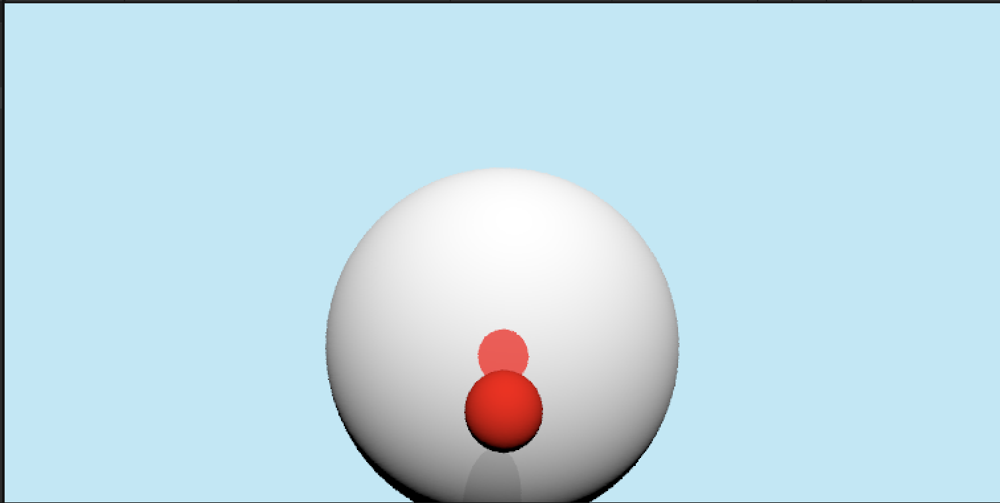

# This is a Raytracer created with Compute Shaders

This is currently a WIP project of mine where I am implementing a Raytracer within the Unity engine using Compute shaders. The scene is specified by placing objects within the Unity scene but all of the rendering is done within the custom compute shaders. 

Currently the Raytracer has ray-sphere intersection, anti-aliasing, diffuse lighting, and shadows implemented.

In the near future I am looking to implement
  - Reflections
  - Specular lighting
  - Refraction
  - Texture sampling

This is a screenshot of the current output of the Raytracer.

